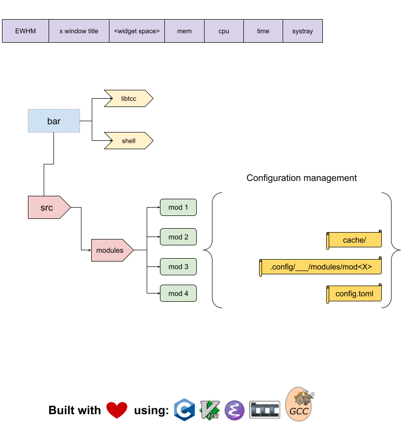

# wmbar

:warning: THIS README IS A WIP, IT'LL BE COMPLETED AND WELL DOCUMENTED ONCE WE HAVE A RUNNING BAR.

 

WMBar is a window manager agnostic status bar that aims to be lightweight, simple, extensible/modular and fast.

This work is based on [bspwmbar](https://github.com/odknt/bspwmbar) by @odknt 

Currently required [nerd-fonts](https://github.com/ryanoasis/nerd-fonts)

## Model



## Features and TODO


## Configure

Modify and recompile `config.h` like `dwm`, `st`.

## Install

Build and install by using `make` and `make install`.

## Build & Debug

```sh
./configure
make

# debug build with AddressSanitizer
make debug

# static analyze with clang
scan-build make debug
```
